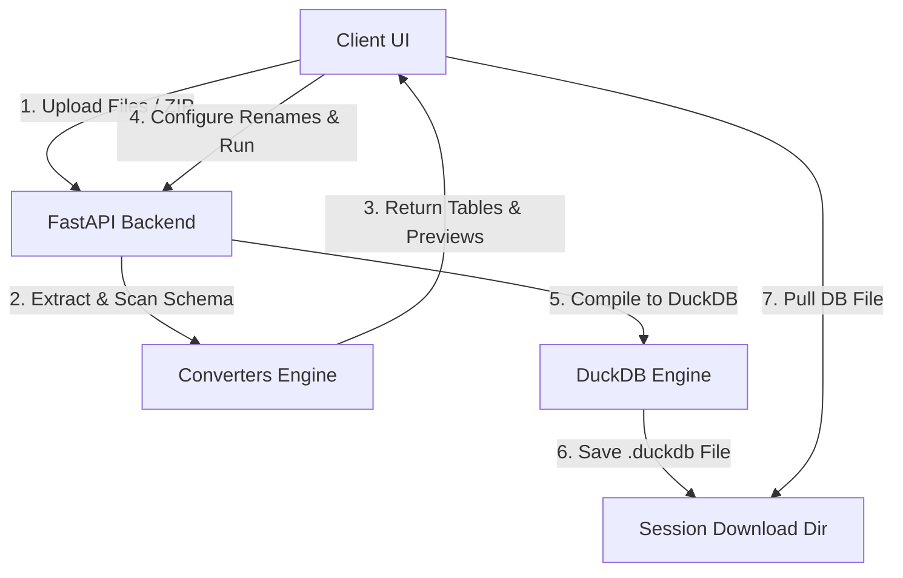

# DuckDB Database Converter

A modern, high-performance web application designed to convert JSON, XML, and SQLite datasets into a single, highly optimized DuckDB database (.duckdb) file. 

The application utilizes a separate React + TypeScript + Tailwind CSS frontend and a FastAPI (Python) backend to process files, preview schemas, sanitize mappings, and run conversion pipelines.

---

## Architecture & Data Flow



### 1. Backend REST API
- **FastAPI / Uvicorn**: Serves endpoints for uploading, schema detection, previewing tables, and downloading compiled databases.
- **Session Manager**: Generates a UUID session directory for each client transaction. The uploads and generated output database files are stored inside `backend/temp_storage/{session_id}`.
- **Automatic Garbage Collection**: An asynchronous task purges folders older than 1 hour to prevent server disk saturation.

### 2. Frontend Wizard Dashboard
- **React + TS + Tailwind**: A responsive interface styling system utilizing a dark glassmorphic design and Lucide icons.
- **Table Preview & Schema Mapping Grid**: Requests sample data (first 10 rows) and displays interactive columns, auto-inferred data types, and mapping parameters.

---

## Data Conversion Logic

### JSON Engine (`json_converter.py`)
- **JSON List of Objects**: Treat the list as a single table.
- **Nested JSON Dictionary**: Iterate over properties. If a property value is an array of objects, it maps into its own table (e.g. `users`, `products`).
- **Object Flattening**: Sub-properties are flattened recursively using `pd.json_normalize` with an underscore separator (e.g., `{"profile": {"age": 30}}` becomes `profile_age`).
- **Data Insertion**: Complex unflattened lists or maps inside values are serialized to JSON string representations inside the final DuckDB columns.

### XML Engine (`xml_converter.py`)
- **Tag Tree Traversal**: The parser recursively scans nodes and distinguishes structural elements (tables) from content elements (columns).
- **Rule for Tables**: A path is classified as a table if:
  1. The path elements have structural attributes or children.
  2. The path occurs multiple times in the document (repeating) OR is a direct child of the XML root.
- **Relational Primary/Foreign Keys**: Assigns a unique integer `_id` to every table element. If a table node is nested inside another table node, it is linked via a foreign key `_parent_{parent_table}_id` to preserve relational hierarchy.
- **Leaf Flattening**: Simple text leaves under a table node are flattened into string columns of that table.

### SQLite Engine (`sqlite_converter.py`)
- **Dual-Mode Import**:
  1. **Native (Primary)**: Uses DuckDB's official SQLite scanner (`ATTACH '{sqlite_path}' AS sqlite_db (TYPE SQLITE)`) to clone tables and schemas in C-level execution speed.
  2. **Streaming Fallback**: If the native binary extension is not loaded/fails, the engine streams data chunk-by-chunk (50,000 rows per chunk) using standard python `sqlite3` and `pandas` DataFrames, avoiding server memory exhaustion on large datasets.

---

## Project Structure

```
duckdb-converter/
├── backend/                  # FastAPI Application
│   ├── app/
│   │   ├── converters/       # Conversion Engines (Base, JSON, XML, SQLite)
│   │   ├── main.py           # API Controller & Endpoints
│   │   └── utils.py          # Session management, ZIP extractor
│   ├── tests/                # Test Suite (pytest)
│   ├── Dockerfile
│   └── requirements.txt
├── frontend/                 # React Single Page App
│   ├── src/
│   │   ├── components/       # Dropzone, Logs, PreviewTable
│   │   ├── App.tsx           # State machine wizard
│   │   └── index.css         # Styling, glassmorphic themes, animations
│   ├── nginx.conf            # Nginx routing config
│   ├── Dockerfile
│   ├── postcss.config.js
│   ├── tailwind.config.js
│   └── vite.config.ts
├── examples/                 # Testing Datasets (XML, JSON, SQLite, ZIP)
├── docker-compose.yml        # Multi-Container Compose Config
└── README.md
```

---

## Installation & Setup

### Option A: Running with Docker (Recommended)

Requires [Docker Desktop](https://www.docker.com/products/docker-desktop/) installed.

1. Clone or navigate to the workspace directory.
2. Build and start both containers:
   ```bash
   docker compose up --build
   ```
3. Open your browser and navigate to **`http://localhost`** to access the web application. The API will run at `http://localhost:8000`.
4. Stop containers using:
   ```bash
   docker compose down
   ```

### Option B: Local Manual Development Setup

#### 1. Start Backend Server
1. Navigate to the `backend/` directory:
   ```bash
   cd backend
   ```
2. Create and activate a Python virtual environment:
   ```bash
   python -m venv .venv
   # Windows:
   .venv\Scripts\activate
   # macOS/Linux:
   source .venv/bin/activate
   ```
3. Install dependencies:
   ```bash
   pip install -r requirements.txt
   ```
4. Start the FastAPI server:
   ```bash
   uvicorn app.main:app --reload --host 127.0.0.1 --port 8000
   ```

#### 2. Start Frontend App
1. Navigate to the `frontend/` directory in a new terminal window:
   ```bash
   cd frontend
   ```
2. Install node dependencies:
   ```bash
   npm install
   ```
3. Start the Vite development server:
   ```bash
   npm run dev
   ```
4. Open the link displayed in the terminal (typically **`http://localhost:5173`**).

---

## Testing & Verification

We have implemented a Pytest suite checking edge cases in data flattening, nested XML parsing, and SQL exports.

1. Navigate to the `backend/` directory:
   ```bash
   cd backend
   ```
2. Run tests:
   ```bash
   .venv\Scripts\python -m pytest
   ```

### Test Files

Use the files in the `examples/` directory for manual uploads:
- `sample.json`: Multiple objects, nested configurations.
- `sample.xml`: Nested review hierarchies, repeated book structures.
- `sample.sqlite`: SQLite database containing a `customers` table and `orders` table linked via foreign key.
- `sample_archive.zip`: Compressed archive containing both JSON and XML sample files.
